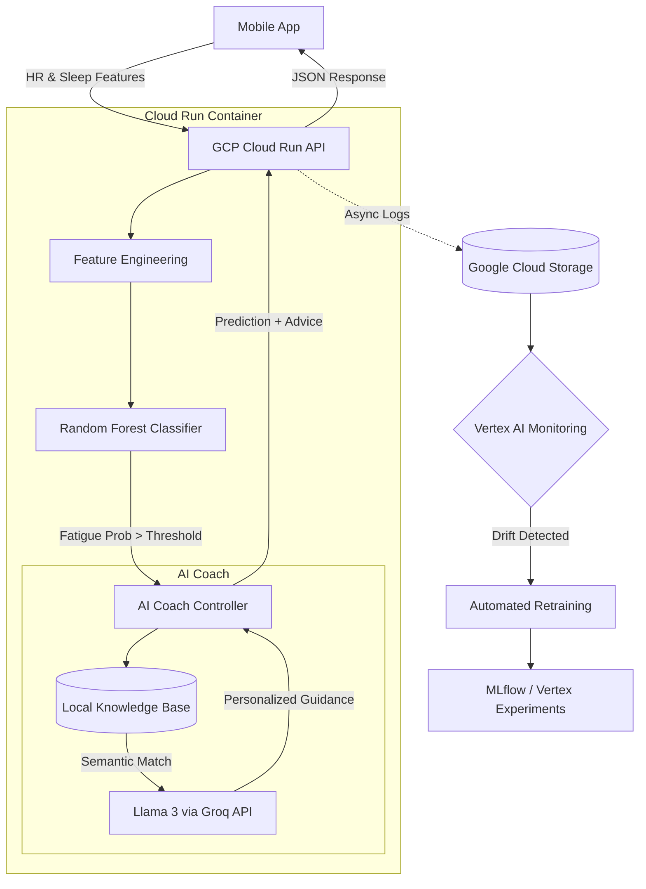

# Fatigue Detection & AI-Assisted Recovery System
This project demonstrates a production-oriented MLOps system augmented with LLM-based user guidance.
The system combines a supervised fatigue prediction model with a context-aware AI coach, forming a closed-loop Predict → Explain → Advise workflow.

Prediction is handled by a classical ML model optimized for reliability.
Advice is generated by an LLM, grounded in model outputs and physiological context.

## System Architecture


## Business Objectives ##
The primary goal of this system is user safety via proactive fatigue prevention. The model optimization strategy reflects a specific trade-off between sensitivity and user experience:

1. **Priority: High Recall (Safety)**
   - Ensure that genuine fatigue events are detected so users can take action before an accident occurs. Missing a fatigue event is the highest cost error.
2. **Constraint: Sustainable Precision (User Experience)**
   - Prevent "alert fatigue." If users receive too many false alarms, they will disable the notifications or abandon the app entirely.

3. **Constraint: Low-Latency Feedback (Timeliness)**:
   - The system targets near real-time inference, with latency budgets enforced at the system level (e.g., <200 ms for server-side inference).

4. **Metric Strategy:**
   - We optimize for Recall on the minority class (Fatigue Event) while enforcing a strict Precision floor. Retraining is triggered not just by data drift, but if the model's Precision drops below a defined threshold (e.g., 75%).

5. **Contextual Recovery Guidance**
   - When fatigue is detected, the system activates an AI Coach, generating a concise, personalized 1–2 line recovery suggestion.

## Model Lifecycle

### Training & Validation
- **Dataset Split:** 60% training, 20% validation, 20% test
- **Cross-Validation:** 5-fold stratified CV to handle class imbalance
- **Hyperparameter Tuning:** Optuna Bayesian hyperparameter optimization for recall while constraining precision ≥65%

### Model Performance
#### Classification Report
```
               precision    recall  f1-score   support
        awake       0.93      0.76      0.83       165
     fatigued       0.69      0.90      0.78       100
     accuracy                           0.81       265
    macro avg       0.81      0.83      0.81       265
 weighted avg       0.84      0.81      0.81       265
```

#### Confusion Matrix Analysis

|                    | Predicted awake | Predicted fatigued |
|--------------------|-----------------|--------------------|
| **Actual  awake**  | 125 (TN)        | 40 (FP)            |
| **Actual fatigued**| 10 (FN)         | 90 (TP)            |

**Why This Performance Matters:**
1. **Safety-First Design**: The 90% recall ensures we catch the vast majority of dangerous fatigue states before they lead to incidents.
2. **Manageable False Positive Rate**: With 40 false alarms out of 165 normal cases (24%), we maintain user trust while prioritizing safety. This is within acceptable bounds to prevent alert fatigue.
3. **Production Readiness**: The F1-score of 0.78 for the fatigued class demonstrates balanced performance suitable for real-world deployment.

### Inference Modes
The system supports two inference modes: The choice between modes is driven by network availability and
operational constraints.

1. **Edge Inference (Offline-First)**: Models are deployed on the mobile device to support intermittent
  connectivity and low-latency predictions.
2. **Server-Side Inference (Always-Online)**: When reliable connectivity is available, feature data is sent to the
  backend for centralized inference, enabling easier monitoring and faster model updates.

## Data Drift Monitoring & Retraining Pipeline
This system utilizes a Server-Side Inference architecture. The mobile application acts as a lightweight client, sending biometric data to a centralized cloud API where heavy-duty inference, monitoring, and model updates occur.

1. **Data Ingestion & Sync**
   - API Interaction: When connectivity is available, the mobile app sends feature vectors (derived from sleep and heart rate data) to the backend API. The API returns the fatigue prediction in real-time.
   - Data Logging: Inputs and predictions are immediately logged to Azure Blob Storage (for feature accumulation) and a relational database (for metadata), creating a unified dataset for future training.

2. **Drift Detection**
   - Scheduled Monitoring: Azure ML runs periodic jobs comparing the statistical properties of incoming live data against the baseline training set.
   - Biometric Shifts: We specifically monitor for shifts in physiological indicators (e.g., changes in population-level Heart Rate Variability or sleep efficiency) that might signal concept drift.

3. **Conditional Retraining & Optimization**
   - Trigger: If drift metrics exceed defined thresholds, an automated retraining pipeline is triggered on Azure ML compute.
   - Business-Driven Optimization: The retraining pipeline optimizes the Random Forest models to maximize recall and maintain precision.

4. **Experiment Tracking & Model Registry**
   - MLflow Integration: All training runs are logged with MLflow, capturing hyperparameters, accuracy metrics (F1, Precision/Recall), and artifacts.
   - Versioning: successful models are automatically registered. The best-performing model is tagged as Production.

5. **Zero-Downtime Deployment**
   - Endpoint Update: Once a new model is validated in Staging, the inference API endpoint is updated to serve the new model version.
   - Transparent Upgrade: Because inference is server-side, the mobile application benefits from improved model performance immediately without requiring an app update or local model download.

 ### Known Limitations
   - Cold-start period required for personalized baselines
   - Performance depends on sensor quality
   - Advice is supportive, not medical guidance
