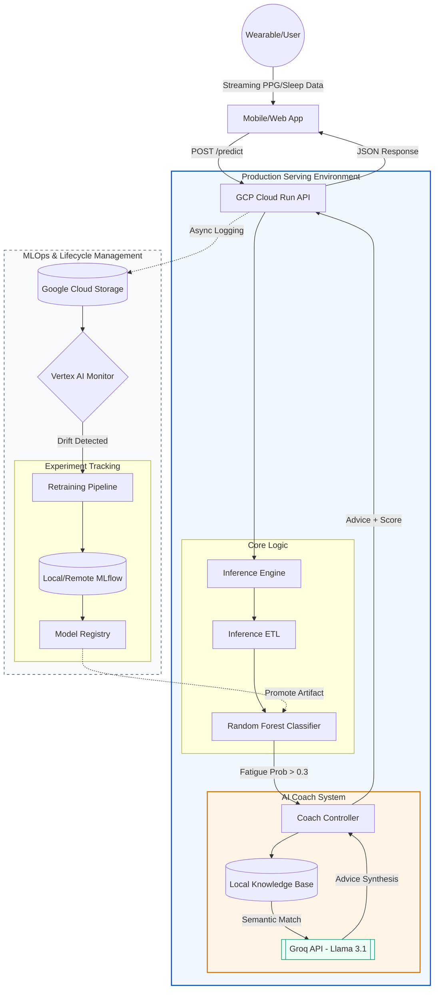

# Fatigue Detection & AI-Assisted Recovery System
1. Project Overview
In high-stakes environments, fatigue is often only recognized after a lapse in judgment occurs. This system moves from reactive monitoring to proactive prevention by transforming raw physiological telemetry into actionable safety interventions.

This system predicts fatigue risk from wearable heart rate and sleep data and delivers real-time, personalized recovery guidance via a production-grade ML pipeline.

### What This Project Demonstrates
- Designing ML systems for safety-critical use cases
- Balancing recall, latency, and user experience
- Production deployment with cost-aware infrastructure
- Responsible integration of LLMs in decision-support systems

## System Architecture
The architecture separates real-time inference from lifecycle management.
Cloud Run handles low-latency prediction, while monitoring and retraining operate asynchronously to avoid impacting user-facing performance.

2. Data Strategy
Source: Physiological sensor data (PPG heart rate and sleep logs). To ensure privacy and robustness, the dataset underwent augmentation with synthetic noise to simulate real-world sensor variability.

Imbalance & Bias: The dataset is naturally imbalanced (8:1 ratio of "Awake" to "Fatigued" states). I utilized stratified sampling and SMOTE during training to ensure the model learned the minority "fatigued" class effectively.

Preprocessing: I implemented windowed normalization to account for individual heart rate baselines, ensuring the model identifies changes in state rather than just raw values.

3. The Model
The primary objective is minimizing false negatives (missed fatigue events), even at the cost of increased false positives.

Model Type: Random Forest Classifier. I chose RF over deep learning for its high interpretability via feature importance and its low computational footprint for serverless deployment.

Baseline vs. Final: The baseline Logistic Regression model failed to capture the non-linear interactions between sleep debt and heart rate volatility. The final RF model achieved a 90% Recall, meeting our safety-first objective.

Decision Path: I explicitly avoided more complex architectures (like LSTMs) to maintain a sub-200ms inference latency budget.

Thresholding: The default decision threshold (0.5) was lowered to 0.4 after analyzing the Precision–Recall curve to reduce false negatives.

4. Training & Experiment Tracking
Tracking: All experiments are managed via MLflow.

Logging: I log Optuna hyperparameter trials, classification reports (Precision/Recall/F1), and confusion matrices for every run.

Versioning: Models are versioned in the MLflow Model Registry, allowing for one-click promotion from 'Staging' to 'Production' without redeploying the container.

5. Deployment & Inference
Serving: The model is served as a REST API using FastAPI and containerized with Docker.

Environment: Hosted on GCP Cloud Run, providing an always-on endpoint.

Scaling: The system is configured for horizontal scaling; GCP automatically spins up additional containers as request volume increases, then scales back to zero when idle to minimize costs.

6. Monitoring & Drift Detection
Monitoring: I track Feature Drift (statistical shifts in heart rate distributions) and Label Drift (shifts in the ratio of fatigue predictions).

Detection: Automated scripts compare live data Z-scores against the training baseline stored in the confs/monitor.yaml.

Action: When drift exceeds a 15% threshold, an alert is logged to GCP Cloud Logging, triggering a notification for manual review or automated retraining.

7. CI/CD & Automation
Automated: Dependency management via uv, container builds, and deployment to GCP via gcloud CLI.

Automation Boundaries: Model promotion remains a manual step. In safety-critical systems, a "Human-in-the-loop" is required to validate that a new model meets the precision floor before it goes live.

8. Production Inference Path
Mobile Client: Sends raw heart rate and sleep history JSON.

Inference ETL: FastAPI converts JSON into a 12-feature vector (calculating hours awake, HRV volatility, etc.).

Classifier: Random Forest generates a fatigue probability score.

AI Coach (RAG): If the score > 0.3, the system retrieves a relevant "Expert Advice" snippet and uses Llama 3.1 to synthesize a personalized, 2-line recovery plan.

Response: The user receives a JSON containing the risk level and the supportive advice.

Latency: End-to-end inference (feature extraction + classification + RAG) is designed to stay under 300ms P95 for real-time feedback.

9. Trade-offs & Limitations
Simplicity: I prioritized a local Knowledge Base for the AI Coach to ensure the advice is grounded in expert safety guidelines and doesn't "hallucinate" medical claims.

Scalability: Current Groq API usage (Llama 3.1) is on the free tier; high-volume production would require a dedicated LLM instance or a smaller, quantized local model.

Cost: The architecture is designed for $0.00 "idle" costs, making it highly efficient for individual or small-team research.

Medical Scope: This system is designed for decision support, not diagnosis.

10. Future Improvements
Personalized Baselines: Implementing "Cold Start" calibration where the model learns a specific user's resting HR over 7 days.
Enhanced RAG: Moving the Knowledge Base to a Vector Database (like Pinecone) to support houndreds of advice documents.
